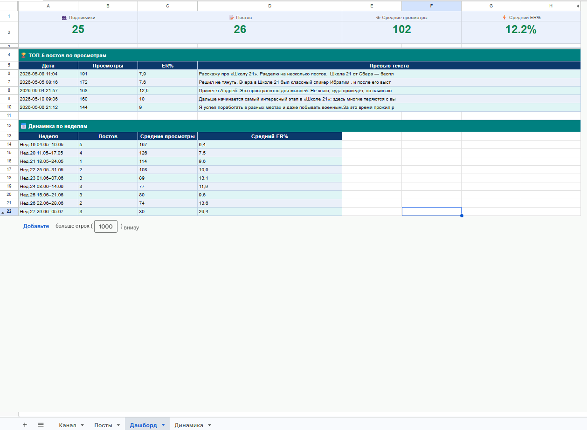

# Telegram Analytics Pipeline

Автоматическая система аналитики Telegram-канала: сбор метрик каждые 6 часов без участия человека, включая временные срезы просмотров и историю оттока/притока подписчиков.

Живой продукт: работает в облаке с июня 2026 на канале [«Приватный эфир»](https://t.me/Private_ether).



## Проблема

Telegram отдаёт только текущее число просмотров поста - истории нет. Невозможно ответить на базовые продуктовые вопросы:

- Какой охват набирает пост за первые сутки? (скорость распространения контента)
- Общее число подписчиков стоит на месте - это стагнация или ротация «пришло 5 / ушло 5»? Первое - проблема привлечения, второе - удержания, и лечатся они противоположно.

Сторонние сервисы аналитики либо платные, либо не работают с малыми каналами. Ручной сбор требует заходить в статистику по расписанию - на практике не выполняется.

## Решение

Пайплайн: **Telethon → Python → Google Sheets → Looker Studio**, запуск по расписанию через **GitHub Actions** (каждые 6 часов, бесплатно, не зависит от включённого компьютера).

```
Telegram-канал
     |  Telethon (userbot-доступ: Bot API не отдаёт просмотры)
     v
stats.py ──────────────┐
     |                 |  GitHub Actions (cron, каждые 6 ч)
     v                 |  секреты - в GitHub Secrets
Google Sheets <────────┘
  ├─ Посты      (метрики по каждому посту + формулы)
  ├─ Динамика   (история подписчиков, append-only)
  ├─ Дашборд    (сводка внутри таблицы, legacy)
  └─ _Аудитория (скрытый служебный слепок ID)
     |
     v
Looker Studio (визуализация, фильтр по периоду)
```

## Ключевые механики

**Временные срезы просмотров (24ч / 72ч).** Раз в 6 часов скрипт вычисляет возраст каждого поста; если пост в окне 24-48 ч и ячейка пустая - фиксирует текущие просмотры как «срез 24ч» (аналогично 72-96 ч). Широкое окно даёт 3-4 попытки на срез - одиночный сбой запуска не теряет данные. Упущенное окно остаётся пустым: «нет данных» честнее выдуманной цифры.

**Отток и приток подписчиков.** Скрипт хранит слепок Telegram ID аудитории и на каждом запуске сравнивает с прошлым: новые ID - «пришло», исчезнувшие - «ушло». История пишется append-only и не стирается ни при каких сбоях. Приватность: только числовые ID на скрытом листе, без имён и username.

**Отказоустойчивость.** Ручные значения в таблице не перезаписываются; шапки листов самовосстанавливаются; сбор аудитории обёрнут так, что его отказ не роняет остальной пайплайн; формулы учитывают локаль таблицы.

## Дашборд

Данные из Google Таблицы визуализируются в Looker Studio: KPI-карточки, динамика подписчиков, приход/уход, топ постов по просмотрам, просмотры по датам, фильтр по произвольному периоду. Тёмная тема, один акцентный цвет.

Обновление: сбор данных каждые 6 часов → таблица → кэш Looker. Ссылка на живой дашборд не публикуется: статистика канала остаётся приватной.

### Почему ERR, а не ER

Скрипт считал несколько метрик вовлечённости. При сборке дашборда выяснилось, что работает только одна:

| Метрика | Формула | Среднее | Максимум | Вывод |
|---|---|---|---|---|
| ER поста % | реакции / подписчики | 132% | 2100% | непригодна |
| 1-Day Reach % | просмотры 24ч / подписчики | 255% | 3400% | непригодна |
| **ERR %** | (реакции + пересылки + комментарии) / просмотры | **13,7%** | 64,7% | **рабочая** |

Причина - знаменатель. ER и Reach делятся на подписчиков, а на старте канала их было 1-2 человека: пост с 21 реакцией при 1 подписчике даёт ER 2100%. Математически верно, по смыслу - мусор. ERR делится на просмотры - это стабильный знаменатель, не зависящий от роста базы, поэтому у ERR нет выбросов.

**Вывод: метрика надёжна ровно настолько, насколько надёжен её знаменатель.** На дашборд вынесена только ERR. Метрики от подписчиков вернутся, когда база стабилизируется - подрисовывать их сейчас значило бы врать себе.

ERR полнее классического ER и по смыслу: пост, который пересылают, важнее поста, которому ставят лайк.

### Два источника подписчиков

Число подписчиков живёт в двух листах с разной логикой обновления:

- **Посты** - подписчики на момент выхода поста (обновляется по событию: вышел пост);
- **Динамика** - снимок каждые 6 часов (обновляется по расписанию).

Карточка «Подписчики» на дашборде читает из «Динамики». Если брать из «Постов», она замирает между публикациями и расходится с графиком: подписчик пришёл, «Динамика» это записала, а «Посты» - нет, потому что нового поста не было.

Одно и то же число в двух источниках с разными триггерами обновления - выбор правильного источника под конкретный вопрос решается на уровне модели данных, а не визуализации.

## Стек

Python (Telethon, gspread, gspread-formatting) · Google Sheets API (сервисный аккаунт) · GitHub Actions (cron + secrets) · Looker Studio · UTC-нормализация дат

## Продуктовые решения и trade-offs

| Решение | Альтернатива | Почему так |
|---|---|---|
| Точность срезов ±6 ч | Сервер 24/7 с точными отметками | Для трендов достаточно; стоимость решения - нулевая |
| Google Sheets как хранилище | БД + BI | Стейкхолдер один, шарится ссылкой, порог входа нулевой |
| Looker Studio для визуализации | Yandex DataLens | Читает Google Sheets напрямую, без публикации данных в интернет |
| Пустая ячейка при упущенном окне | Записать текущие просмотры задним числом | Фальшивые данные хуже отсутствующих: ломают средние |
| ID-слепок аудитории | Логировать username ушедших | Приватность важнее детализации churn-анализа |
| Одна метрика вовлечённости (ERR) | Показать все три | Две сломанные метрики рядом с рабочей обесценивают дашборд |

## Планы

- Убрать ER% из листа «Дашборд» внутри таблицы (сейчас там осталась метрика, признанная непригодной)
- Вернуть Reach на дашборд, когда база подписчиков стабилизируется
- Взвешенный по просмотрам ERR (сейчас каждый пост имеет равный вес)
- Дневная агрегация «Динамики» по мере роста данных
- Корреляция оттока с контентом (какие посты «выносят» подписчиков)

## Автор

Андрей — [@Private_ether](https://t.me/Aysvoch)
