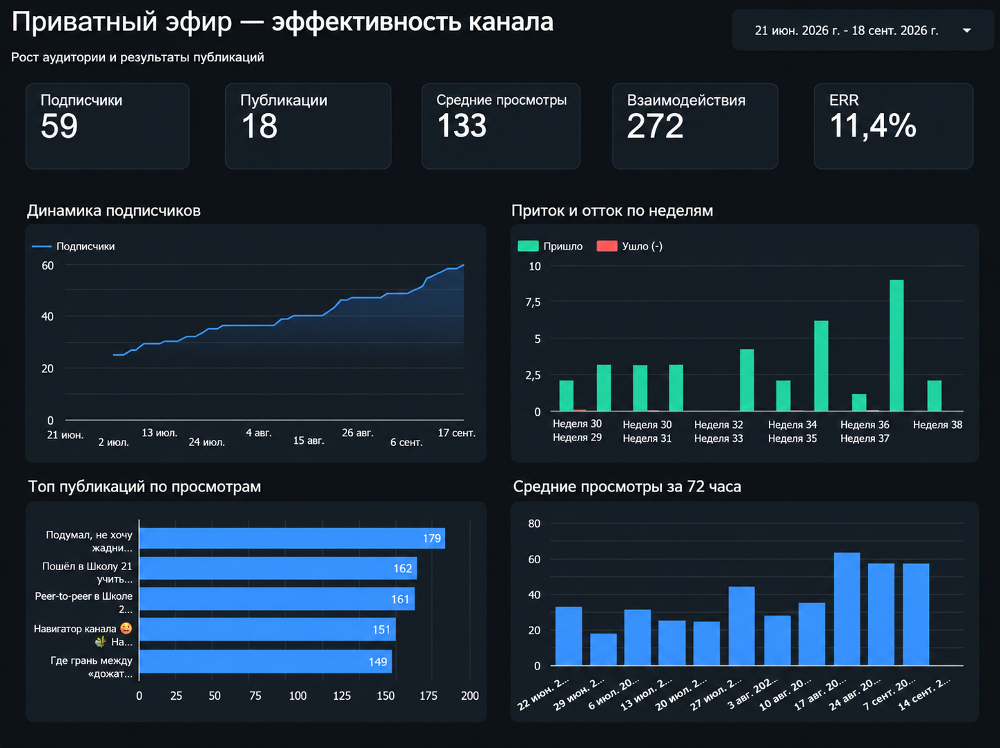
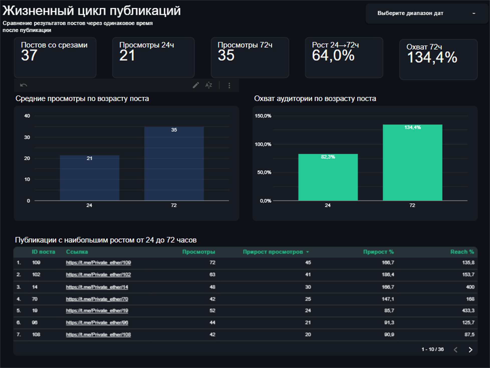

# Аналитика Telegram-канала «Приватный эфир»

**Автоматический сбор метрик канала: от текущего состояния аудитории до жизненного цикла каждой публикации.**

Раз в 6 часов система забирает данные из Telegram, сохраняет историю в Google Таблицах и обновляет закрытый дашборд в Looker Studio. Работает в облаке с июня 2026 года на канале [«Приватный эфир»](https://t.me/Private_ether).

## Проблема

Telegram показывает текущее число просмотров и подписчиков, но не хранит историю изменений. Из интерфейса нельзя ответить на вопросы, ради которых и нужна аналитика:

- аудитория действительно стоит на месте или внутри идут приток и отток;
- сколько просмотров пост набирает за 24 и 72 часа;
- какие публикации растут дольше одного дня, а какие быстро затухают;
- меняется ли вовлечённость вместе с ростом канала.

Ручные замеры по расписанию быстро перестают быть регулярными, а без них сравнение постов разного возраста нечестное: старые почти всегда выглядят сильнее новых.

## Решение

```text
Telegram-канал
      |
      v
Telethon + Python ── сбор каждые 6 часов через GitHub Actions
      |
      v
Google Таблицы
  ├─ Посты      текущие метрики публикаций
  ├─ Динамика   история аудитории
  └─ Срезы      контрольные точки 6 / 24 / 72 / 168 часов
      |
      v
Looker Studio   обзор канала + жизненный цикл публикаций
```

Сбор работает без включённого компьютера. Повторный запуск не создаёт дубли, а пропущенный исторический замер остаётся пустым: система не дорисовывает прошлое.

## Что получилось

### Обзор канала



На одной странице — текущее состояние канала, динамика подписчиков, приток и отток по неделям, лучшие публикации и средние просмотры через 72 часа. Период меняется общим фильтром.

### Жизненный цикл публикаций



Здесь посты сравниваются в одинаковом возрасте. Видно, сколько просмотров и охвата они получают через 24 и 72 часа, как растут после первых суток и какие публикации дают самый длинный хвост.

Живой дашборд не публикуется: статистика канала остаётся приватной.

## Ключевые механики

**Срезы одного возраста.** Для каждого поста фиксируются контрольные точки 6, 24, 72 и 168 часов вместе с фактическим временем замера. Поэтому новый пост можно честно сравнить со старым.

**Приток и отток.** Система сопоставляет снимки числовых Telegram ID и отдельно считает, сколько человек пришло и ушло. Имена и username не сохраняются.

**Метрики с понятным знаменателем.** В обзоре используется ERR по просмотрам, а Reach вынесен на страницу жизненного цикла и привязан к фиксированному возрасту поста.

**Безопасное обновление.** Медиагруппы собираются в одну публикацию, ручные значения не стираются, неполный снимок аудитории не попадает в историю, а общий доступ к Google Drive скрипту не требуется.

## Стек

Python · Telethon · gspread · Google Sheets API · GitHub Actions · Looker Studio

## Автор

Андрей · [@Aysvoch](https://t.me/Aysvoch) · [«Приватный эфир»](https://t.me/Private_ether)
